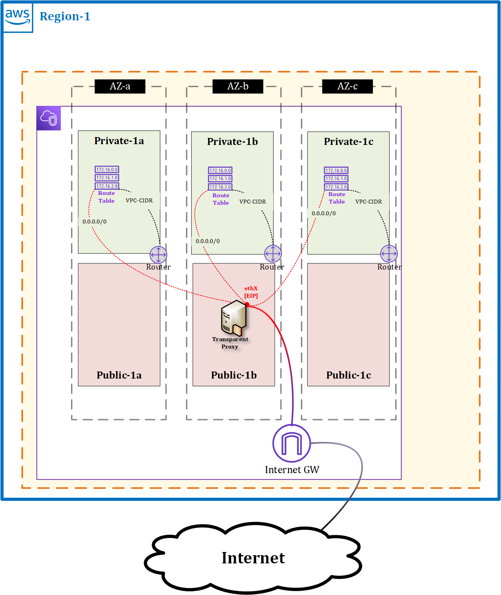
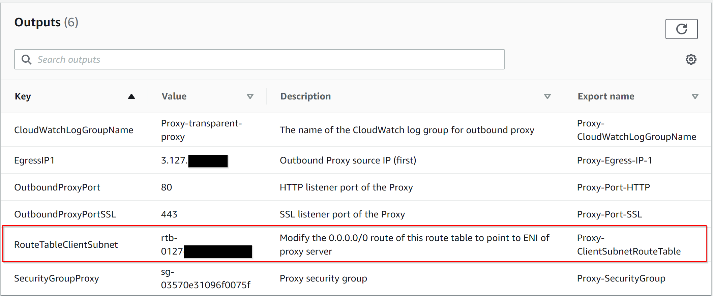
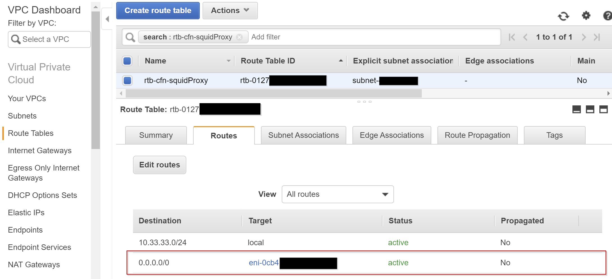

# Transparent Squid Proxy in AWS (into existing VPC)

Originally [published by AWS](https://aws.amazon.com/blogs/security/how-to-add-dns-filtering-to-your-nat-instance-with-squid/).

For security and compliance purposes, you might have to filter the requests initiated by these instances (also known as “egress filtering”). Using iptables rules, you could restrict outbound traffic with your NAT instance based on a predefined destination port or IP address. However, you might need to enforce more complex security policies, such as allowing requests to AWS endpoints only, or blocking fraudulent websites, which you can’t easily achieve by using iptables rules.

This CloudFormation template gives an example of how to use Squid, a leading open-source proxy, to implement a “transparent proxy” that can restrict both HTTP and HTTPS outbound traffic to a given set of Internet domains, while being fully transparent for instances in the private subnet.

# Difference

This template differs from the original AWS template in that the original one suggests iptables/NAT to forward incoming traffic on tcp ports 80 and 443 to tcp ports 3128 and 3129 respectively. My template uses Linux **setcap** command to allow Squid to listen on tcp ports 80 and 443. However it is still possible to change default ports if you want as it uses template parameters to set these values in squid configuration file (it modifies squid.conf file based on the paremeters set for "SSL Proxy Port", "HTTP Proxy Port" and "CIDR Block Allowed").

# Manual step

For clients to connect to internet through a transparent proxy, their default route must be the transparent proxy server. To achieve this, a manual step is required. After the stack completes, the route table it creates must be modified with a default route pointing to ENI of the proxy server.

# Usage

Create a new stack with CloudFormation.

**DO NOT** forget to set your default route to point to the interface of your Squid instance.

